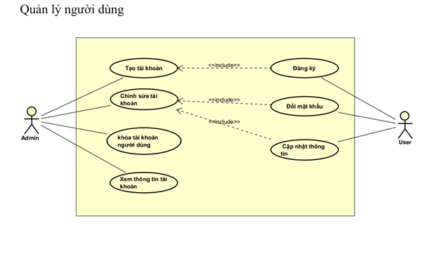
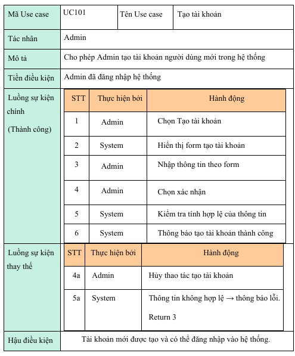
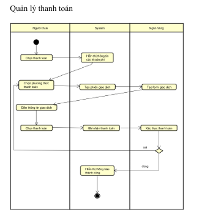
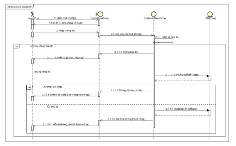
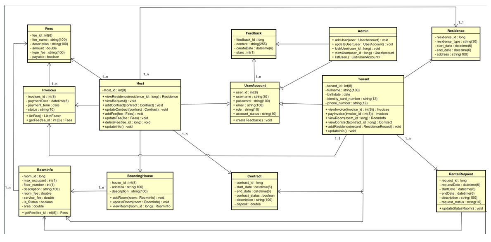

# 🏠 Phân tích và Thiết kế Hệ thống Quản Lý Nhà Trọ

Dự án nhằm xây dựng hệ thống **quản lý nhà trọ** với mục tiêu hỗ trợ chủ trọ quản lý thông tin phòng, hợp đồng thuê, khách thuê, chi phí và các nghiệp vụ liên quan.  
Việc phân tích và thiết kế hệ thống được thực hiện theo hướng **hướng đối tượng (OOAD)**, sử dụng các biểu đồ UML để mô tả trực quan.  

---

## 📖 Nội dung phân tích và thiết kế

1. **Mô tả tổng quan hệ thống**  
   - Quản lý thông tin phòng trọ  
   - Quản lý khách thuê  
   - Quản lý hợp đồng thuê  
   - Quản lý thu chi (tiền phòng, điện, nước, dịch vụ)  
   - Hỗ trợ tìm kiếm, thống kê, báo cáo  

2. **Biểu đồ phân tích và thiết kế**  

### 🔹 Use Case Diagram

### 🔹 Biểu đồ phân rã Use Case

### 🔹 Activity Diagram

### 🔹 Sequence Diagram

### 🔹 Class Diagram

---

## ⚙️ Công cụ sử dụng
- **Ngôn ngữ mô hình hóa**: UML  
- **Công cụ vẽ**: astah UML

---

## 📌 Thông tin
- Dự án phục vụ mục đích học tập và nghiên cứu về **phân tích thiết kế hệ thống thông tin**.  
